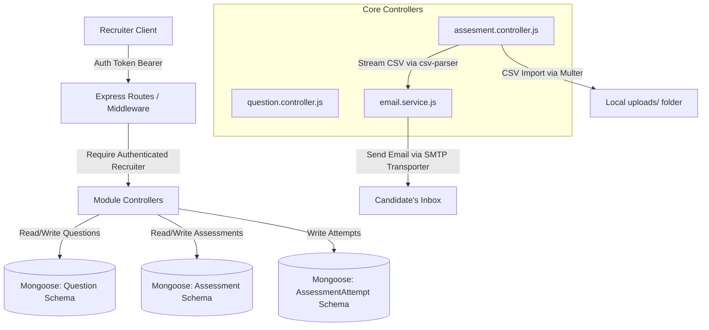

# Technical Documentation: Assessment Builder (Recruiter Side)

This document provides an exhaustive, line-by-line technical walkthrough and explanation of the **Assessment Builder** feature in the EvalForge platform. The Assessment Builder is a core recruiter-facing module that allows organizations to create questions, compile assessments, set runtime constraints (time limits, allowed languages), and invite candidates individually, in bulk, or via CSV file uploads.

---

## 🗺️ Architectural Overview

The Assessment Builder follows a modular Model-View-Controller (MVC) architecture on the backend, built with **Node.js**, **Express**, and **MongoDB/Mongoose**.

The system is split into three main backend modules:
1. **Questions Module (`src/modules/Questions`)**: Handles question creation and bank retrieval.
2. **Notifications Module (`src/modules/Notifications`)**: Integrates with Mail SMTP via Nodemailer to dispatch invite links.
3. **Assessments Module (`src/modules/Assessments`)**: The core builder which handles assessment configurations and candidate invites (via JSON payloads or multipart CSV uploads).

### Data Flow Diagram



---

## 🗄️ Database Schemas & Data Modeling

The feature relies on four Mongoose schemas located in the `src/models` directory. Let's analyze how they are structured.

### 1. Questions Schema ([`Question.js`](file:///c:/EvalForge/Backend/src/models/Question.js))
Defines the structure for coding challenges.

```javascript
const mongoose = require('mongoose');

const TestCaseSchema = new mongoose.Schema({
  input: {
    type: String,
    required: true
  },
  expectedOutput: {
    type: String,
    required: true
  },
  isHidden: {
    type: Boolean,
    default: false
  }
}, { _id: false });
```
*   **`TestCaseSchema`**: Represents test inputs and expected outputs to run against candidates' code. `_id: false` is used to disable subdocument IDs, making the MongoDB documents cleaner. `isHidden` separates public sample cases from private validation test cases.

```javascript
const QuestionSchema = new mongoose.Schema(
  {
    title: {
      type: String,
      required: true,
      trim: true
    },
    description: {
      type: String,
      required: true
    },
    constraints: {
      type: String,
      default: ''
    },
    difficulty: {
      type: String,
      enum: ['easy', 'medium', 'hard'],
      required: true
    },
    starterCode: {
      type: Map,
      of: String,
      default: {}
    },
    testCases: [TestCaseSchema],
    scoreWeight: {
      type: Number,
      default: 10
    }
  },
  {
    timestamps: true
  }
);
```
*   **`starterCode`**: Stored as a Mongoose `Map` where keys represent languages (e.g., `'javascript'`, `'python'`) and values represent the boilerplate code template.
*   **`scoreWeight`**: Allows recruiters to specify the impact (points) of this question on the total assessment grade.

### 2. Assessments Schema ([`Assessment.js`](file:///c:/EvalForge/Backend/src/models/Assessment.js))
Configures the parameters of a specific assessment.

```javascript
const AssessmentSchema = new mongoose.Schema(
  {
    title: {
      type: String,
      required: true,
      trim: true
    },
    description: {
      type: String,
      default: ''
    },
    orgId: {
      type: mongoose.Schema.Types.ObjectId,
      ref: 'Organization',
      required: true
    },
    questions: [
      {
        type: mongoose.Schema.Types.ObjectId,
        ref: 'Question'
      }
    ],
    timeLimit: {
      type: Number, // duration in minutes
      required: true
    },
    allowedLanguages: {
      type: [String],
      default: ['javascript', 'python', 'cpp', 'java']
    },
    status: {
      type: String,
      enum: ['draft', 'active', 'archived'],
      default: 'draft'
    },
    inviteToken: {
      type: String,
      unique: true,
      default: () => crypto.randomUUID()
    }
  },
  {
    timestamps: true
  }
);
```
*   **`orgId`**: Links the assessment to a specific recruiter organization, ensuring data separation between companies.
*   **`questions`**: An array of references to the `Question` model.
*   **`inviteToken`**: A unique UUID automatically generated per assessment. This token forms the invite link URL (e.g., `/join/:inviteToken`), allowing candidates to register and log in to take the assessment.

### 3. Assessment Attempts Schema ([`AssesmentAttempts.js`](file:///c:/EvalForge/Backend/src/models/AssesmentAttempts.js))
Tracks candidate progress and performance on a specific assessment.

```javascript
const AssessmentAttemptSchema = new mongoose.Schema(
  {
    candidateId: {
      type: mongoose.Schema.Types.ObjectId,
      ref: 'User',
      required: true
    },
    assessmentId: {
      type: mongoose.Schema.Types.ObjectId,
      ref: 'Assessment',
      required: true
    },
    startedAt: {
      type: Date,
      default: Date.now
    },
    submittedAt: {
      type: Date
    },
    totalScore: {
      type: Number,
      default: 0
    },
    rank: {
      type: Number
    },
    status: {
      type: String,
      enum: ['started', 'submitted', 'expired'],
      default: 'started'
    }
  },
  {
    timestamps: true
  }
);
```
*   **`status`**: Can be `'started'`, `'submitted'`, or `'expired'`. This prevents candidates from attempting a test multiple times or submitting after the countdown finishes.

### 4. Users Schema ([`Users.js`](file:///c:/EvalForge/Backend/src/models/Users.js))
Contains account data, distinguishing recruiters from candidate users.

```javascript
const UserSchema = new mongoose.Schema(
  {
    name: { type: String, required: true, trim: true },
    email: { type: String, required: true, unique: true, lowercase: true, trim: true },
    passwordHash: { type: String, required: true },
    role: { type: String, enum: ['recruiter', 'candidate', 'admin'], default: 'candidate' },
    orgId: { type: mongoose.Schema.Types.ObjectId, ref: 'Organization', default: null }
  },
  { timestamps: true }
);
```

---

## 🔒 Security Middleware & Routing

Security is managed using JWT authentication tokens combined with role-based access control (RBAC).

### Role Verification Middleware ([`auth.middleware.js`](file:///c:/EvalForge/Backend/src/modules/Authentication&Roles/auth.middleware.js))

```javascript
const requireAuth = (req, res, next) => {
    const authHeader = req.headers.authorization;
    // Extract token from Bearer header
    const token = authHeader && authHeader.startsWith('Bearer ') ? authHeader.split(' ')[1] : authHeader;
    try {
        if (token) {
            const decoded = jwt.verify(token, process.env.JWT_SECRET);
            req.user = decoded; // Injects decrypted payload (id, role, orgId) into request
            next();
        } else {
            res.status(401).json({ message: 'No token provided' });
        }
    } catch (err) {
        res.status(401).json({ message: 'Invalid or Expired Token' });
    }
}
```
*   **`requireAuth`**: Extracts the JWT from the request authorization headers, decodes it using the server's private `JWT_SECRET`, and attaches the decrypted credentials to `req.user`.

```javascript
const authorizeRoles = (...roles) => {
    return (req, res, next) => {
        if (!req.user || !roles.includes(req.user.role)) {
            return res.status(403).json({ message: 'Access denied: Insufficient permissions' });
        }
        next();
    }
}
```
*   **`authorizeRoles('recruiter')`**: Generates a middleware check asserting that the client's role exists within the authorized roles array. If the user's role is not `'recruiter'`, they are blocked with a `403 Forbidden` response.

---

## 📂 Phase 2: Questions Module

The Questions module allows recruiters to manage coding challenges.

### Question Controller ([`question.controller.js`](file:///c:/EvalForge/Backend/src/modules/Questions/question.controller.js))

#### 1. Question Creation Flow (`createQuestion`)
Creates a new question item.

```javascript
exports.createQuestion = async (req, res, next) => {
    try {
        const { title, description, constraints, difficulty, starterCode, testCases, scoreWeight } = req.body;
        // Validation
        if (!title || !description || !difficulty) {
            return res.status(400).json({ message: "Title, description and difficulty are required" });
        }
        // Creation
        const newQuestion = await Questions.create({
            title,
            description,
            constraints,
            difficulty,
            starterCode: starterCode || {},
            testCases: testCases || {},
            scoreWeight: scoreWeight || 10
        });
        return res.status(201).json({
            message: "Question created successfully",
            question: newQuestion
        });
    } catch (err) {
        console.error("Create question error:", err);
        return res.status(500).json({ message: "Server error while creating question." });
    }
};
```
*   **Line 7**: Checks for mandatory inputs: `title`, `description`, and `difficulty` to avoid database pollution.
*   **Line 10**: Calls Mongoose `Questions.create()` using the model alias `Questions`.
*   **Lines 15-17**: Assign defaults (`{}` or `10`) if fields are omitted in the request.

#### 2. Get Question Bank Flow (`getQuestionBank`)
Returns the list of available challenges.

```javascript
exports.getQuestionBank = async(req, res) => {
    try {
        const questions = await Questions.find({}).select('.testCases');
        return res.status(200).json(questions);
    } catch (err) {
         console.error("Get question bank error:", err);
        return res.status(500).json({ message: "Server error while fetching question bank." });
    }
};
```
> [!IMPORTANT]
> **Line 32**: `.select('.testCases')` is a typo in the original repository code. To hide test cases from the lists (preventing candidates from inspecting test inputs/outputs via the global list endpoint), this should be `.select('-testCases')`. The dot (`.`) should be a minus sign (`-`) to exclude the field in MongoDB projections.

#### 3. Fetch Single Question (`getQuestionDetails`)
Retrieves the complete data of a specific question (often used by recruiters to preview or edit test cases).

```javascript
exports.getQuestionDetails = async (req, res) => {
    try {
        const { id } = req.params;
        const question = await Questions.findById(id); // Corrected from Question.findById
        if (!question) {
            return res.status(404).json({ message: "Question not found." });
        }
        return res.status(200).json(question);
    } catch (err) {
        console.error("Get question details error:", err);
        return res.status(500).json({ message: "Server error." });
    }
};
```
*   **Line 44**: Extracts the MongoDB `ObjectId` from URL request parameters (`req.params.id`).
*   **Line 46**: Validates if the record exists.

### Question Router ([`question.routes.js`](file:///c:/EvalForge/Backend/src/modules/Questions/question.routes.js))

Exposes endpoints mapped to the controller methods:

```javascript
QuestionRouter.post('/', requireAuth, authorizeRoles('recruiter'), createQuestion);
QuestionRouter.get('/', requireAuth, authorizeRoles('recruiter'), getQuestionBank);
QuestionRouter.get('/:id', requireAuth, authorizeRoles('recruiter'), getQuestionDetails);
```
*   All endpoints require JWT authorization (`requireAuth`) and are restricted to users with the `'recruiter'` role.

---

## 📂 Phase 3: Notifications Module

This module sends invitation emails to candidates.

### Email Service ([`email.service.js`](file:///c:/EvalForge/Backend/src/modules/Notifications/email.service.js))

```javascript
const nodemailer = require('nodemailer');
require('dotenv').config();

// Create Nodemailer Transporter
const transporter = nodemailer.createTransport({
    host: process.env.EMAIL_HOST || 'smtp.mailtrap.io',
    port: process.env.EMAIL_PORT || 2525,
    auth: {
        user: process.env.EMAIL_USER,
        pass: process.env.EMAIL_PASS
    }
});
```
*   **`nodemailer.createTransport`**: Configures the SMTP protocol engine using host and credentials stored in `Backend/.env` (falling back to Mailtrap for developer testing).

```javascript
exports.sendAssessmentInvite = async (toEmail, candidateName, assessmentTitle, inviteLink) => {
    const mailOptions = {
        from: `"EvalForge Admin" <no-reply@evalforge.com>`,
        to: toEmail,
        subject: `Invitation to complete assessment: ${assessmentTitle}`,
        html: `
            <div style="font-family: Arial, sans-serif; padding: 20px; color: #333;">
                <h2>Hello ${candidateName || 'Candidate'},</h2>
                <p>You have been invited to attempt the technical assessment: <strong>${assessmentTitle}</strong>.</p>
                <p>Click the button below to join the assessment and begin when you are ready:</p>
                <div style="margin: 25px 0;">
                    <a href="${inviteLink}" style="background-color: #4F46E5; color: white; padding: 12px 24px; text-decoration: none; border-radius: 5px; font-weight: bold;">
                        Start Assessment
                    </a>
                </div>
                ...
            </div>
        `
    };
    return transporter.sendMail(mailOptions);
};
```
*   **`sendAssessmentInvite`**: Sends a clean HTML-formatted email layout with the unique candidate registration link.

---

## 📂 Phase 4: Assessments Module

This is the core module of the Assessment Builder.

### Assessment Controller ([`assesment.controller.js`](file:///c:/EvalForge/Backend/src/modules/Assessments/assesment.controller.js))

#### 1. Create Assessment Flow (`createAssesment` / `createAssessment`)
Instantiates a new test blueprint.

```javascript
exports.createAssesment = async (req, res) => {
    try {
        const { title, description, timeLimit, allowedLanguages, questions } = req.body;
        const orgId = req.user.orgId; // Extracted from decoded requireAuth token

        if (!title || !timeLimit) {
            return res.status(400).json({ message: "Title and time limit are required." });
        }
        
        // Optional validation: Ensure all question IDs exist in DB
        if (questions && questions.length > 0) {
            const count = await Questions.countDocuments({ _id: { $in: questions } });
            if (count !== questions.length) {
                return res.status(400).json({ message: "One or more question IDs are invalid." });
            }
        }

        const newAssesment = await Assessment.create({
            title,
            description,
            timeLimit,
            allowedLanguages: allowedLanguages || ['JavaScript', 'python', 'cpp', 'java'],
            questions: questions || [],
            orgId,
            status: 'draft' // Default to draft for editing before publishing
        });
        
        return res.status(201).json({
            message: "Assessment created successfully",
            assessment: newAssesment // Fix: original had 'newAssessment' which was undefined due to camelCase typo
        });

    } catch (err) {
        console.error("Create assessment error:", err);
        return res.status(500).json({ message: "Server error while creating assessment." });
    }
}
```
*   **Line 17**: Automatically extracts the recruiter's `orgId` from the JWT token, preventing users from creating assessments under unauthorized company profiles.
*   **Line 21**: Validates that all question IDs referenced in the payload actually exist in the `questions` collection.
*   **Line 35**: Defaults the status to `'draft'` to allow recruiters to review and edit the assessment before publishing.

#### 2. Get Assessments (`getRecruiterAssessments`)
Fetches assessments configured by the recruiter's organization.

```javascript
exports.getRecruiterAssessments = async (req, res) => {
    try {
        const orgId = req.user.orgId;
        const assessments = await Assessment.find({ orgId }).populate('questions', 'title difficulty scoreWeight');
        return res.status(200).json(assessments);
    } catch (err) {
        console.error("Get assessments error:", err);
        return res.status(500).json({ message: "Server error." });
    }
};
```
*   **Line 51**: Queries assessments by `orgId`. It uses Mongoose `.populate()` to resolve question references and returns only public-facing fields (`title`, `difficulty`, `scoreWeight`), leaving out sensitive test cases.

#### 3. Update Assessment Blueprint (`updateAssessment`)
Updates draft attributes or publishes/archives assessments.

```javascript
exports.updateAssessment = async (req, res) => {
    try {
        const { id } = req.params;
        const orgId = req.user.orgId;
        const { title, description, timeLimit, allowedLanguages, status, questions } = req.body;
        
        const assessment = await Assessment.findOne({ _id: id, orgId });
        if (!assessment) {
            return res.status(404).json({ message: "Assessment not found or unauthorized." });
        }
        
        if (title) assessment.title = title;
        if (description !== undefined) assessment.description = description;
        if (timeLimit) assessment.timeLimit = timeLimit;
        if (allowedLanguages) assessment.allowedLanguages = allowedLanguages;
        if (status) assessment.status = status;
        if (questions) assessment.questions = questions;
        
        await assessment.save();
        return res.status(200).json({ message: "Assessment updated successfully", assessment });
    } catch (err) {
        console.error("Update assessment error:", err);
        return res.status(500).json({ message: "Server error." });
    }
};
```
*   **Line 64**: Performs a combined check for assessment ID and `orgId`. This ensures recruiters can only update assessments belonging to their own organization.

#### 4. Bulk Email Invites (`bulkEmailInvite`)
Distributes invitations to a manual list of candidates.

```javascript
exports.bulkEmailInvite = async (req, res) => {
    try {
        const { id } = req.params;
        const { candidates } = req.body; // Array format: [{ name: "Alice", email: "alice@example.com" }]
        const orgId = req.user.orgId;
        
        const assessment = await Assessment.findOne({ _id: id, orgId });
        if (!assessment) {
            return res.status(404).json({ message: "Assessment not found." });
        }
        if (!candidates || !Array.isArray(candidates) || candidates.length === 0) {
            return res.status(400).json({ message: "Candidates array is required." });
        }
```
*   **Lines 84-93**: Validates parameters and confirms the assessment belongs to the organization.

```javascript
        const invitePromises = candidates.map(candidate => {
            const inviteLink = `${process.env.FRONTEND_URL}/candidate/join/${assessment.inviteToken}`;
            return sendAssessmentInvite(candidate.email, candidate.name, assessment.title, inviteLink)
                .catch(err => {
                    console.error(`Failed to invite ${candidate.email}`, err);
                })
        });
        await Promise.all(invitePromises);
        return res.status(200).json({ message: "Candidates invited successfully" });
```
> [!NOTE]
> **Line 7 vs Line 96**: In the original file imports, the email utility is imported as `const { sendAssesmentInvite } = require('../Notifications/email.service')` (with a single 's' typo in the variable name). However, at lines 96 and 145, it is executed as `sendAssessmentInvite(...)` (with double 's'). This discrepancy will result in a runtime error (`ReferenceError: sendAssessmentInvite is not defined`). The import statement needs to be corrected to match the function name.
*   **`Promise.all`**: Runs Nodemailer deliveries concurrently, accelerating delivery times for multiple invites. It uses a `.catch()` block inside the `.map()` loop to catch individual email failures, preventing one failed delivery from blocking other invitations.

#### 5. CSV Invitation Imports (`csvInvite`)
Streams, parses, and invites candidate emails uploaded in a CSV file.

```javascript
exports.csvInvite = async (req, res) => {
    try {
        const { id } = req.params;
        const orgId = req.user.orgId;
        if (!req.file) {
            return res.status(400).json({ message: "CSV file is required." });
        }
        const assessment = await Assessment.findOne({ _id: id, orgId });
        if (!assessment) {
            fs.unlinkSync(req.file.path); // Clean up temp file storage
            return res.status(404).json({ message: "Assessment not found." });
        }
```
*   **`req.file`**: Express middleware (Multer) uploads the CSV file to the `uploads/` server directory and adds details to `req.file`.
*   **`fs.unlinkSync`**: Clears the temporary file from the server if the assessment query fails, preventing storage bloat.

```javascript
        const candidates = [];
        // Read CSV stream and parse rows
        fs.createReadStream(req.file.path)
            .pipe(csv())
            .on('data', (row) => {
                // Expects headers "name" and "email" (case-insensitive checking)
                const name = row.name || row.Name || row.NAME;
                const email = row.email || row.Email || row.EMAIL;
                if (email) {
                    candidates.push({ name: name ? name.trim() : '', email: email.trim() });
                }
            })
```
*   **`fs.createReadStream`**: Reads the uploaded file as a data stream rather than loading it entirely into memory, which protects performance when handling large files.
*   **`csv()`**: Parses headers and emits a `'data'` event for each row. The code checks for variations in capitalization (`row.name`, `row.Name`, `row.NAME`) to make the format more user-friendly.

```javascript
            .on('end', async () => {
                // Delete temp file after streaming
                fs.unlinkSync(req.file.path);
                
                if (candidates.length === 0) {
                    return res.status(400).json({ message: "No valid emails found in the CSV." });
                }
                
                // Send Emails
                const invitePromises = candidates.map(candidate => {
                    const inviteLink = `${process.env.FRONTEND_URL || 'http://localhost:5173'}/join/${assessment.inviteToken}`;
                    return sendAssessmentInvite(candidate.email, candidate.name, assessment.title, inviteLink)
                        .catch(err => console.error(`Failed to send CSV email to ${candidate.email}:`, err));
                });
                await Promise.all(invitePromises);
                return res.status(200).json({ message: `Successfully invited ${candidates.length} candidates from CSV.` });
            })
            .on('error', (err) => {
                console.error("Error reading CSV stream:", err);
                if (fs.existsSync(req.file.path)) fs.unlinkSync(req.file.path);
                return res.status(500).json({ message: "Failed parsing the CSV file." });
            });
```
*   **`end`**: Fires once parsing completes.
*   **`fs.unlinkSync`**: Deletes the file immediately after parsing to keep server storage clean.
*   **`error`**: Handles parsing issues. It checks for the file's existence and deletes it to avoid leaving orphaned uploads in the file system.

#### 6. Candidate Access Portal (`joinAssessment`)
Auto-registers and generates session access for invited candidates.

```javascript
const joinAssessment = async (req, res) => {
    try {
        const { inviteToken } = req.params;
        const { name, email } = req.body;

        // 1. Validate request body
        if (!name || !email) {
            return res.status(400).json({ message: "Name and email are required to join the assessment." });
        }

        // 2. Find active assessment by invite token
        const assessment = await Assessment.findOne({ inviteToken });
        if (!assessment || assessment.status !== 'active') {
            return res.status(404).json({ message: "Assessment not found or is currently inactive." });
        }
```
*   **Line 177**: Validates that the assessment is marked as `'active'`. Candidates cannot join tests that are still in `'draft'` or have been `'archived'`.

```javascript
        // 3. Find or auto-register candidate
        let candidate = await User.findOne({ email });

        if (candidate) {
            // Ensure existing user has the correct role
            if (candidate.role !== 'candidate') {
                return res.status(403).json({ message: "Unauthorized: Only candidate accounts can join assessments." });
            }
        } else {
            // Auto-register candidate with a secure random password
            const randomPassword = crypto.randomBytes(16).toString('hex');
            const passwordHash = await bcrypt.hash(randomPassword, 10);

            candidate = await User.create({
                name,
                email,
                passwordHash,
                role: 'candidate',
                orgId: null
            });
        }
```
*   **Lines 181-201**: Simplifies onboarding. If a candidate doesn't have an account, the system automatically registers them with a secure random password hash (`bcrypt`) under the `'candidate'` role.

```javascript
        // 4. Find or create assessment attempt
        let attempt = await AssessmentAttempt.findOne({
            candidateId: candidate._id,
            assessmentId: assessment._id
        });

        if (attempt) {
            // Block repeat attempts if the test is completed or expired
            if (attempt.status !== 'started') {
                return res.status(400).json({ message: "You have already submitted or expired this assessment." });
            }
        } else {
            // Start a new attempt
            attempt = await AssessmentAttempt.create({
                candidateId: candidate._id,
                assessmentId: assessment._id,
                status: 'started',
                startedAt: new Date()
            });
        }
```
*   **Lines 203-222**: Creates or retrieves the attempt tracker. If the attempt status is `'submitted'` or `'expired'`, the candidate is blocked from joining again.

```javascript
        // 5. Generate session tokens
        const { accessToken, refreshToken } = await generateToken(candidate);

        // 6. Set HttpOnly Cookie
        res.cookie('refreshToken', refreshToken, {
            httpOnly: true,
            secure: process.env.NODE_ENV === 'production',
            sameSite: 'strict',
            maxAge: 7 * 24 * 60 * 60 * 1000 // 7 days
        });

        // 7. Return successful session & config details to candidate (excluding questions to prevent scraping)
        return res.status(200).json({
            message: "Joined assessment successfully",
            accessToken,
            refreshToken,
            attempt,
            assessment: {
                title: assessment.title,
                description: assessment.description,
                timeLimit: assessment.timeLimit,
                allowedLanguages: assessment.allowedLanguages
            }
        });
```
*   **`httpOnly` cookie**: Secures the refresh token against XSS scripting exploits.
*   **Security measure**: The response omits the assessment's question list. The frontend must query the questions individually as the candidate progress through the test, preventing candidates from scraping the entire exam syllabus at the start.

### Assessment Router ([`assesment.routes.js`](file:///c:/EvalForge/Backend/src/modules/Assessments/assesment.routes.js))

Routes mapping with Multer upload middleware:

```javascript
const multer = require('multer');
const upload = multer({ dest: 'uploads/' });

// Public endpoint for candidates to join via token link
AssessmentRouter.post('/join/:inviteToken', joinAssessment);

// Recruiter-protected endpoints
AssessmentRouter.post('/', requireAuth, authorizeRoles('recruiter'), createAssessment);
AssessmentRouter.get('/', requireAuth, authorizeRoles('recruiter'), getRecruiterAssessments);
AssessmentRouter.put('/:id', requireAuth, authorizeRoles('recruiter'), updateAssessment);

// Inviting candidates
AssessmentRouter.post('/:id/invite/email', requireAuth, authorizeRoles('recruiter'), bulkEmailInvite);
AssessmentRouter.post('/:id/invite/csv', requireAuth, authorizeRoles('recruiter'), upload.single('file'), csvInvite);
```
*   **`upload.single('file')`**: Processes the multi-part upload named `'file'` and saves it to the temporary local disk directory before invoking `csvInvite`.

---

## 🔗 Route Wiring

Both routers are configured in [`server.js`](file:///c:/EvalForge/Backend/server.js):

```javascript
const AssessmentRouter = require('./src/modules/Assessments/assesment.routes');
const QuestionRouter = require('./src/modules/Questions/question.routes');

app.use('/api/assessments', AssessmentRouter);
app.use('/api/questions', QuestionRouter);
```

---

## 💡 Developer Reference: Identified Bugs and Typo Warning

When maintaining or updating this module, keep in mind the following code bugs/typos present in the codebase:

1. **Email Service Mismatched Import**:
   In [`assesment.controller.js`](file:///c:/EvalForge/Backend/src/modules/Assessments/assesment.controller.js):
   ```javascript
   // TYPO: Imports with single 's'
   const { sendAssesmentInvite } = require('../Notifications/email.service');
   ```
   But in lines 96 and 145, it is called as:
   ```javascript
   sendAssessmentInvite(...) // Error: Undefined
   ```
   *Resolution*: Correct the import spelling to use double `ss` to match the export in `email.service.js`.

2. **Question Bank Projections**:
   In [`question.controller.js`](file:///c:/EvalForge/Backend/src/modules/Questions/question.controller.js):
   ```javascript
   // TYPO: Uses '.testCases' instead of '-testCases'
   const questions = await Questions.find({}).select('.testCases');
   ```
   *Resolution*: Change `.testCases` to `-testCases` to exclude test cases from the response payload, securing them from public inspection.

3. **Mismatched Variable Reference**:
   In [`assesment.controller.js`](file:///c:/EvalForge/Backend/src/modules/Assessments/assesment.controller.js) creation endpoint:
   ```javascript
   const newAssesment = await Assessment.create({ ... });
   return res.status(201).json({
       message: "Assessment created successfully",
       assessment: newAssessment // TYPO: newAssessment is undefined (should be newAssesment)
   });
   ```
   *Resolution*: Update the variable names to match (`newAssessment` or `newAssesment`).
