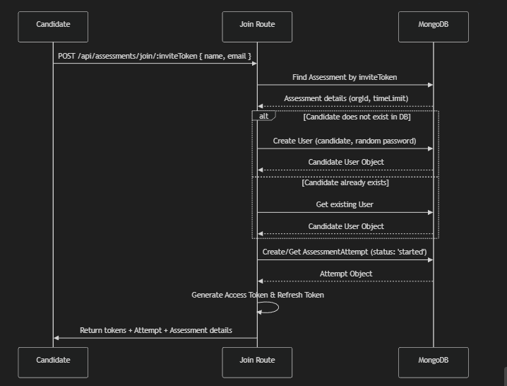

### The Restructured Folder Structure

Here is how the directory structure inside `Backend/src/modules` looks now:

```text
Backend/src/modules/
├── Authentication&Roles/
│   └── .gitkeep               # Candidates/Recruiters login, JWTs, RBAC middleware
├── Organizations/
│   └── .gitkeep               # Recruiter Company/Org signups & management
├── Assessments/
│   └── .gitkeep               # Assessment Builder, settings, invites, landing logic
├── Questions/
│   └── .gitkeep               # Question bank, custom questions & test-case details
├── CodeExecution/
│   └── .gitkeep               # Job Queue, BullMQ setup, Worker & Judge0 Integration
├── Submissions/
│   └── .gitkeep               # Candidate Code Submissions & Auto-Grading logic
├── Analytics/
│   └── .gitkeep               # Leaderboard, Charts data & CSV exporter
└── Notifications/
    └── .gitkeep               # Email invites, reminders & completion alerts
```

---

### Feature-to-Module Mapping & Implementation Plan

Here is what you should build inside each of these folders as you progress feature-by-feature:

#### 1. `Authentication&Roles`
* **Purpose:** Handles candidate/recruiter login, access & refresh token generation/rotation, and role-based access control.
* **What to add here:**
  * `auth.controller.js` (Login, refresh token, candidate self-signup, logout)
  * `auth.middleware.js` (JWT authentication and role-checking helpers like `authorizeRoles`)
  * `auth.routes.js`

#### 2. `Organizations`
* **Purpose:** Manages organization entities separate from individual candidate registries.
* **What to add here:**
  * `org.controller.js` (Recruiter organization sign-up flow, fetching company profile)
  * `org.routes.js`

#### 3. `Assessments`
* **Purpose:** Allows recruiters to configure assessments and candidates to read instructions and join assessments.
* **What to add here:**
  * `assessment.controller.js` (Creating/editing/retrieving assessments, generating unique assessment invite links, candidate joining route)
  * `assessment.routes.js`

#### 4. `Questions`
* **Purpose:** Manages standard question pools and allows custom question definitions.
* **What to add here:**
  * `question.controller.js` (Adding questions to bank, configuring starter codes, test cases, and difficulty)
  * `question.routes.js`

#### 5. `CodeExecution`
* **Purpose:** The isolated sandboxed code execution backend. Uses Redis & BullMQ to queue submissions and send them safely to Judge0.
* **What to add here:**
  * `queue.service.js` (Setting up Redis connection and BullMQ queue for code execution)
  * `worker.js` (The background script consuming submissions, executing code via Judge0 API, and retrieving runtimes)
  * `judge0.service.js` (Wrapper for hosted Judge0 API requests)

#### 6. `Submissions`
* **Purpose:** Handles coding editor triggers (running sample test cases vs. submitting final code) and grading calculations.
* **What to add here:**
  * `submission.controller.js` (Pushing user code run/submit requests to the execution queue, checking status, auto-grading based on matching test cases)
  * `submission.routes.js`

#### 7. `Analytics`
* **Purpose:** Calculates leaderboard standings, aggregates statistics, and compiles data exports.
* **What to add here:**
  * `analytics.controller.js` (Retrieving recruiter metrics, completion funnels, question success rates, CSV export compiler)
  * `analytics.routes.js`

#### 8. `Notifications`
* **Purpose:** Sends out automatic and manual transactional emails.
* **What to add here:**
  * `email.service.js` (Nodemailer setup with SendGrid/Resend)
  * `templates/` (HTML email templates for candidate invites, reminders, and score completion alerts)


  Data Flow of First Feature:
